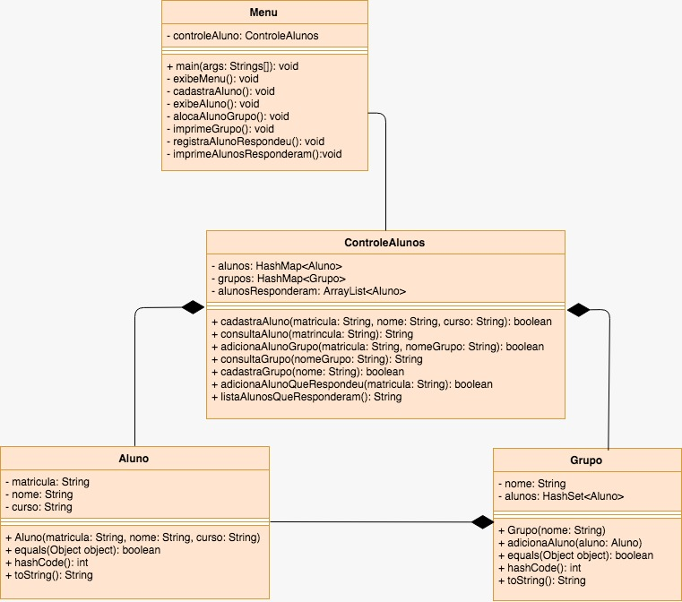

# Controle de Aluno e Grupo de Estudos
Mini projeto para **Controle de Alunos e Grupos de Estudos** para a disciplina de Laboratório de Programação II da UFCG
referente ao curso de Ciências da Computação. Desenvolvido em Java 8 e uso da metodologia TDD com JUnit.

## Documentação

Documentação do projeto: https://juliafealves.github.io/controle-aluno/

## Requisitos do Projeto:

Neste laboratório, construiremos um sistema que será a base do controle de alunos de Programação II. Como sistema, deve ser possível primeiramente cadastrar e consultar alunos. Cada aluno tem uma matrícula, nome e curso (todos strings). Cada consulta deve procurar o aluno a partir de sua matrícula. O aluno é identificado unicamente pela matrícula e não deve ser possível alterar os dados dos alunos uma vez cadastrado.
Os alunos podem se juntar em grupos de estudo. Cada grupo de estudo tem um tema (string, como por exemplo o tema “Coleções”) e é formado por um conjunto de alunos. O aluno pode estar em mais de um grupo de estudo. Deve ser possível colocar alunos em tais grupos a partir de sua matrícula. Cada grupo é identificado unicamente a partir do nome do grupo.
Por fim, durante as aulas, os alunos costumam fazer exercícios em quadro e responder perguntas feitas pelo professor. O professor deseja manter um registro dos alunos que responderam tais perguntas. É possível que o mesmo aluno seja questionado mais que uma vez e preciso registrar a ordem que os mesmos responderam.
O programa deve iniciar com um menu como indicado abaixo.

```
(C)adastrar Aluno
(E)xibir Aluno
(N)ovo Grupo
(A)locar Aluno no Grupo e Imprimir Grupos
(R)egistrar Aluno que Respondeu
(I)mprimir Alunos que Responderam
(O)ra, vamos fechar o programa!

Opção>
```

Ao longo da execução do sistema, caso o usuário passe uma entrada inválida (nula ou vazia) o sistema deve lançar uma exceção e ser encerrado.
Mais detalhes do que deve ser feito neste laboratório abaixo.

### 1. Cadastrar Aluno

Ao selecionar para cadastrar um aluno, o sistema deve pedir informações como a matrícula, nome e curso.
```
Matrícula: 250
Nome: Gabriel Reyes
Curso: Computação
CADASTRO REALIZADO!
```

Quando a matrícula cadastrada já existe, o aluno não deve ser cadastrado e uma mensagem deve ser exibida como mostra o exemplo abaixo.

```
Matrícula: 250
Nome: Mei-Ling Zhou
Curso: Computação
MATRÍCULA JÁ CADASTRADA!
```

Após cada ação do sistema, o menu deve ser novamente impresso e uma opção deve ser novamente selecionada.

### 2. Consultar Aluno
Para consultar alunos, apenas a matrícula deve ser pedida como entrada e a saída abaixo deve ser produzida em caso do aluno daquela matrícula existir:

```
Matrícula: 250
Aluno: 250 - Gabriel Reyes - Computação
```

Caso o aluno não exista, uma mensagem indicando que o aluno não foi cadastrado deve ser exibida:

```
Matrícula: 2500
Aluno não cadastrado.
``` 

### 3. Cadastrar Grupo
Para cadastrar um grupo basta colocar um nome associado a este grupo. Maiúsculas e minúsculas são indistintas (i.e. o grupo “Listas” é igual ao grupo “listas”). Uma mensagem de sucesso deve ser exibida como a indicada abaixo:

```
Grupo: Listas
CADASTRO REALIZADO!
```

Caso o usuário cadastre um grupo com um nome já existente, a mensagem "GRUPO JÁ CADASTRADO!" deve ser exibida.

### 4. Alocar Alunos em Grupos

Durante a alocação, o usuário é perguntado se ele deseja alocar ou imprimir um grupo.

```
(A)locar Aluno ou (I)mprimir Grupo? A
```

Caso o usuário selecione alocar, ele segue para o pedido de entrada apresentado abaixo.
Para alocar alunos em grupos, basta selecionar uma matrícula e nome do grupo para realizar a alocação. Caso o aluno já esteja no grupo, a mesma mensagem pode ser repetida e nada é alterado na sua alocação.

```
Matricula: 250
Grupo: LISTAS
ALUNO ALOCADO!
```

Caso o aluno não esteja cadastrado ou o grupo não esteja cadastrado, as mensagens: “Aluno não cadastrado.” e “Grupo não cadastrado.” devem ser impressas, respectivamente.

### 5. Imprimir Grupos
Caso o usuário peça para imprimir um grupo, o sistema deve pedir como entrada o nome do grupo a ser impresso e exibir o nome do grupo  (como inserido originalmente) e os alunos que fazem parte desse grupo. A ordem que os alunos são impressos não é importante para o sistema.

```
Grupo: listas
Alunos do grupo Listas:
* 250 - Gabriel Reyes - Computação
* 200 - Angela Ziegler - Medicina
```

Caso o grupo de estudo não esteja cadastrado, a mensagem “Grupo não cadastrado.” deve ser exibida em tela.

### 6. Cadastrar Alunos que Respondem Questões no Quadro
Para cadastrar os alunos que respondem questões, o usuário basta apenas colocar a matrícula do aluno que respondeu uma questão. Novamente a mensagem “Aluno não cadastrado.” deve ser exibida caso uma matrícula não tenha aluno associado. Abaixo um exemplo de uma alocação de sucesso.

```
Matricula: 250
ALUNO REGISTRADO!
```

### 7. Imprimir Alunos que Respondem Questões no Quadro

Por fim, ao imprimir os alunos que responderam questões, a lista de alunos deve ser impressa juntamente com a ordem que os alunos responderam questões, como indicado no exemplo abaixo.

```
Alunos:
1. 250 - Gabriel Reyes - Computação
2. 200 - Angela Ziegler - Medicina
3. 250 - Gabriel Reyes - Computação
4. 201 - Torbjorn Lindholm - Engenharia Mecanica
5. 201 - Torbjorn Lindholm - Engenharia Mecanica
```

## Diagrama de Classe


